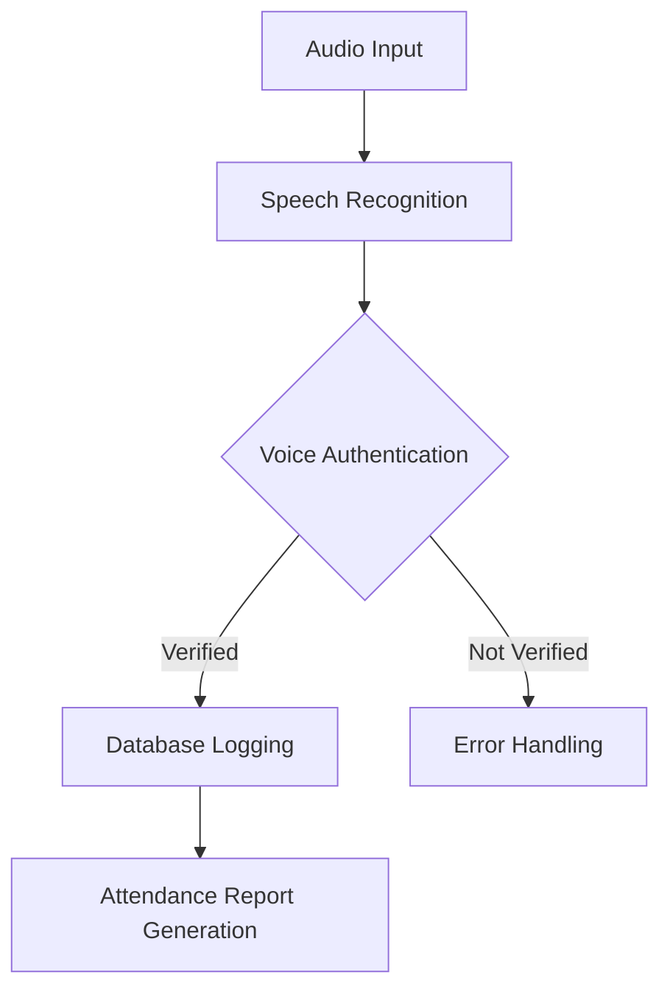

# Audio-Based Attendance System

An innovative attendance system that uses voice recognition to mark attendance efficiently and securely. This project leverages audio processing and speech recognition to streamline the attendance process in classrooms, workplaces, or events.

---

## Features

- **Speech Recognition**: Converts spoken input into text to mark attendance.
- **Voice Authentication**: Validates identity using voice biometrics (optional).
- **Real-Time Processing**: Instantly logs attendance.
- **Secure Data Storage**: Stores attendance data in a database with encryption.
- **Accessible**: Suitable for visually impaired individuals or hands-free environments.

---

## Technology Stack

- **Programming Language**: Python
- **Audio Processing**: SpeechRecognition library, pyannote.audio
- **Database**: Supabase (PostgreSQL backend)
- **Frameworks**: Flask or Streamlit (for UI)
- **Cloud Services** (optional): Google Speech-to-Text, Azure Speech Services
- **Hardware**: Microphone or audio input device

---

## Setup Instructions

### Prerequisites

1. Install Python (>= 3.8)
2. Create a virtual environment:
   ```bash
   python -m venv venv
   source venv/bin/activate  # On Windows: venv\Scripts\activate
   ```
3. Install required Python libraries:
   ```bash
   pip install -r requirements.txt
   ```

### Clone the Repository

```bash
git clone https://github.com/yourusername/audio-based-attendance.git
cd audio-based-attendance
```

### Install Dependencies

1. Ensure the required libraries are installed:
   ```bash
   pip install SpeechRecognition flask streamlit supabase-py
   ```
2. For voice authentication, install `pyannote.audio`:
   ```bash
   pip install pyannote.audio
   ```

### Database Setup

1. Set up your Supabase project.
2. Create a table for attendance with the following schema:
   ```sql
   CREATE TABLE attendance (
       id SERIAL PRIMARY KEY,
       name VARCHAR(100),
       timestamp TIMESTAMP DEFAULT CURRENT_TIMESTAMP
   );
   ```
3. Update the `.env` file with your database credentials:
   ```env
   SUPABASE_URL=<your_supabase_url>
   SUPABASE_KEY=<your_supabase_api_key>
   ```

### Running the Application

1. Run the backend server (Flask):
   ```bash
   python app.py
   ```
2. (Optional) Launch the UI (Streamlit):
   ```bash
   streamlit run ui.py
   ```

---

## Workflow Diagram

Below is a simplified workflow of the audio-based attendance process:



---

## How It Works

1. **Audio Input**: Speak into the microphone when prompted.
2. **Speech Recognition**: The system converts speech to text and checks the database.
3. **Authentication**: (Optional) Matches voice against stored profiles.
4. **Database Logging**: Marks attendance with a timestamp.
5. **Report Generation**: Produces attendance summaries and trends.

---

## Future Enhancements

- Support for multiple languages and accents.
- Noise-cancellation for improved accuracy.
- Mobile application for remote attendance.
- Analytics dashboard for attendance trends.

---

## Contributing

Contributions are welcome! Follow these steps to contribute:
1. Fork the repository.
2. Create a new branch:
   ```bash
   git checkout -b feature-name
   ```
3. Commit changes and push:
   ```bash
   git commit -m "Add feature name"
   git push origin feature-name
   ```
4. Submit a pull request.

---

## License

This project is licensed under the MIT License. See the [LICENSE](LICENSE) file for details.

---

## Contact

**Mani Surya Teja**  
Email: [your-email@example.com](mailto:your-email@example.com)  
GitHub: [https://github.com/yourusername](https://github.com/yourusername)

---

## Acknowledgements

- Python community for amazing libraries.
- [Supabase](https://supabase.com/) for seamless database integration.
- Open-source contributors for speech recognition tools.
